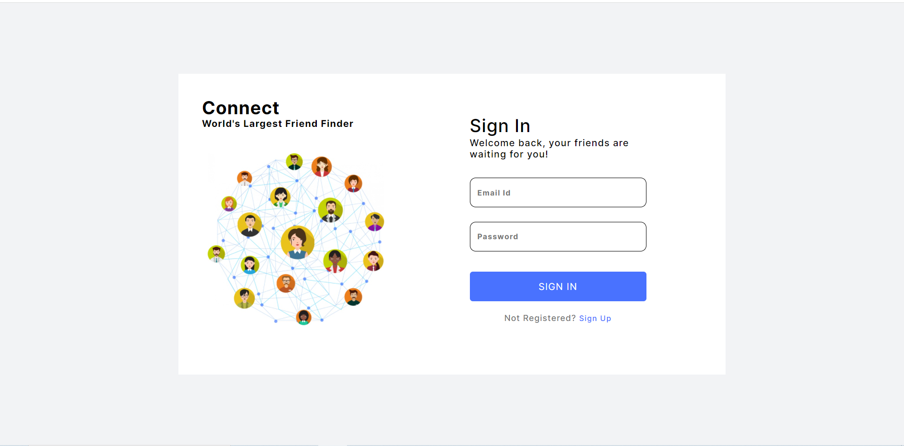
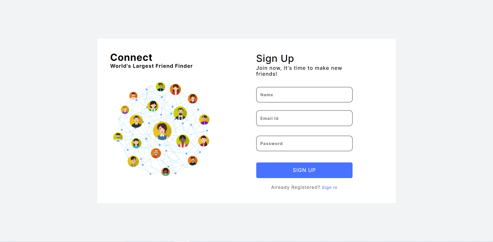
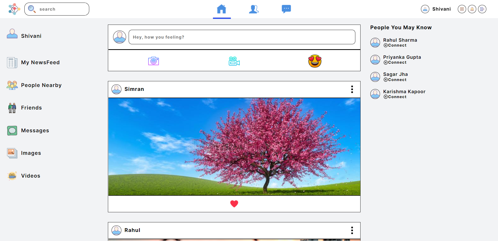
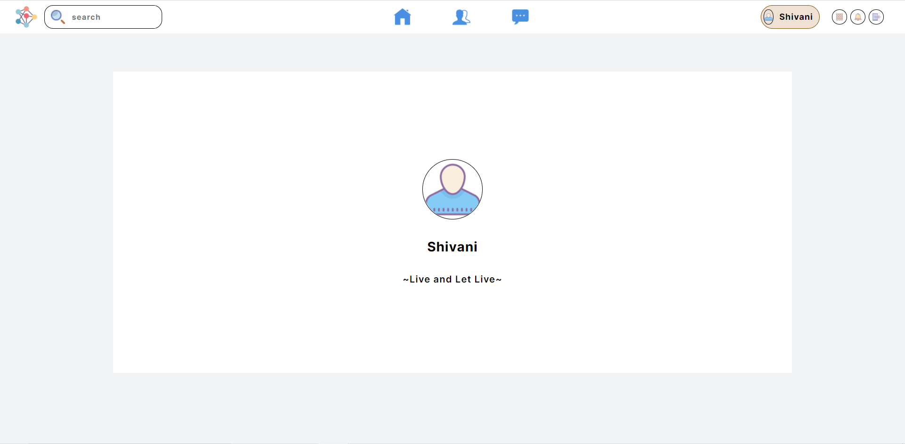

# Connect Frontend

## Setup:

-   Install Node.js
-   Clone this repository
-   Run `npm install`

## Development:

-   Run `npm start`

## Production:

-   Run `npm run build`

## Backend Code:

[connect-backend](https://github.com/shivu-srk/connect-backend)

## Public URL

[Connect: World's Largest Friend Finder](https://connect-30ec.onrender.com/)

## Web Screenshots

Thank you :)

Happy Coding :)
